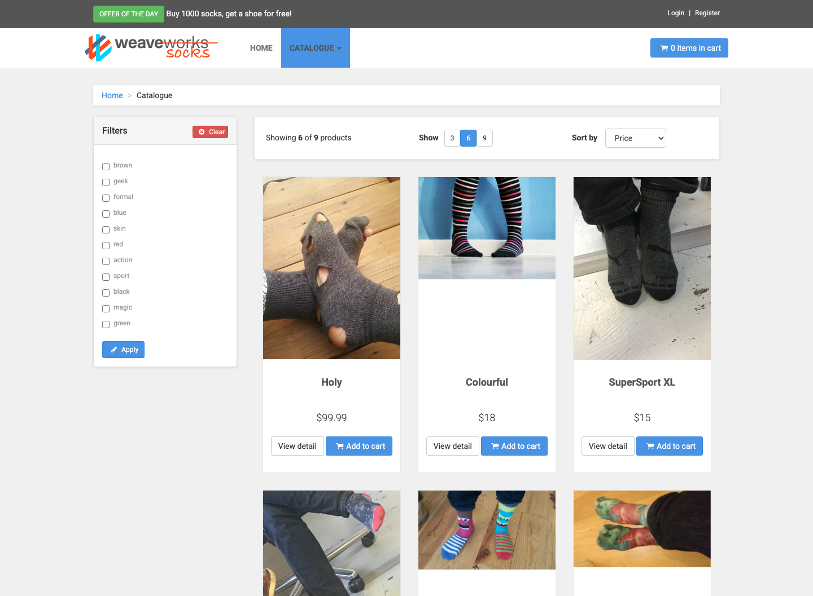
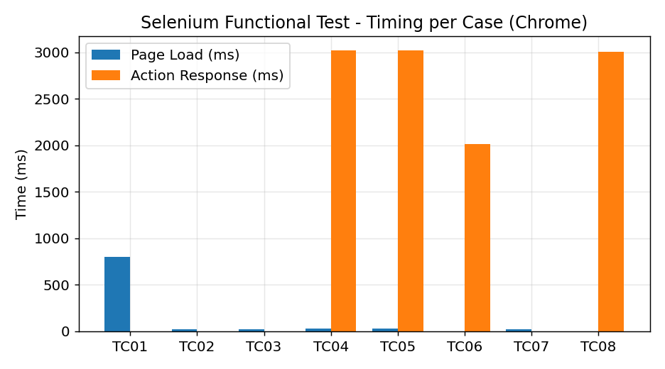
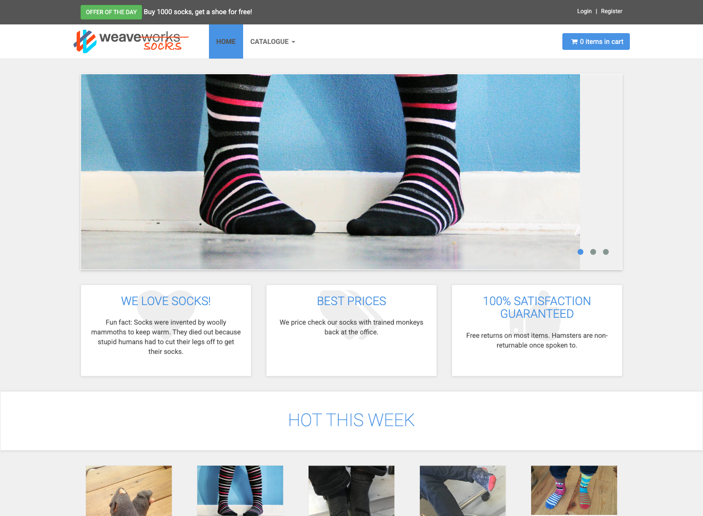
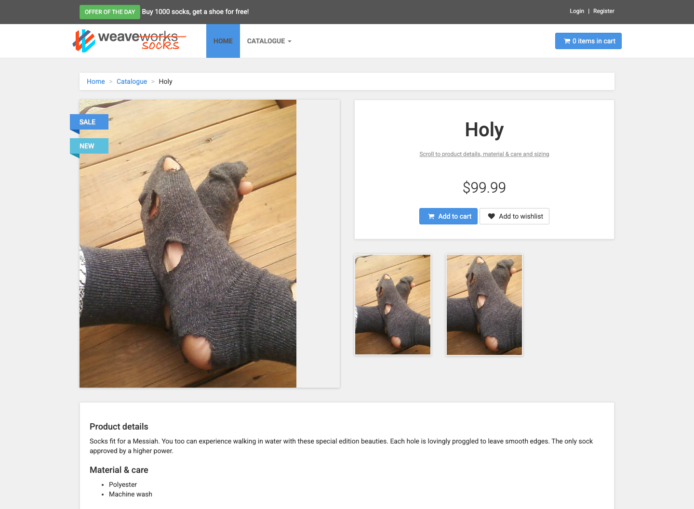
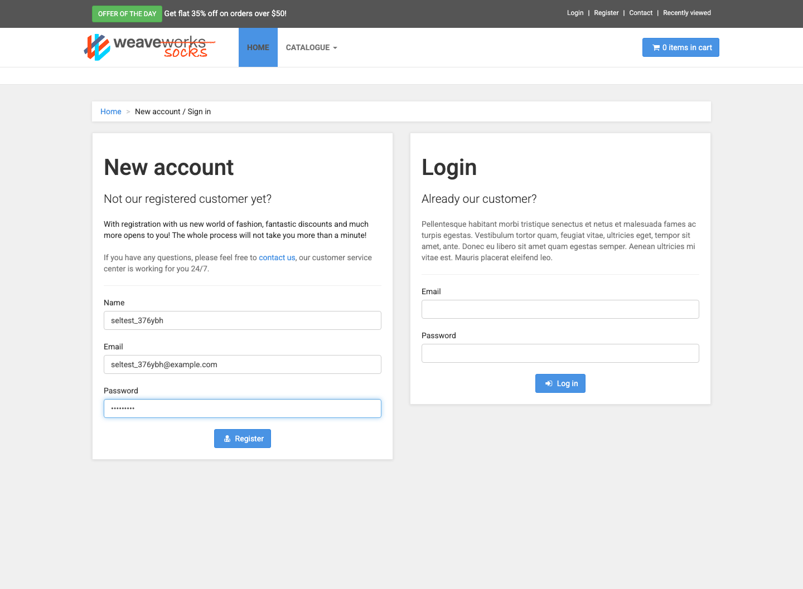
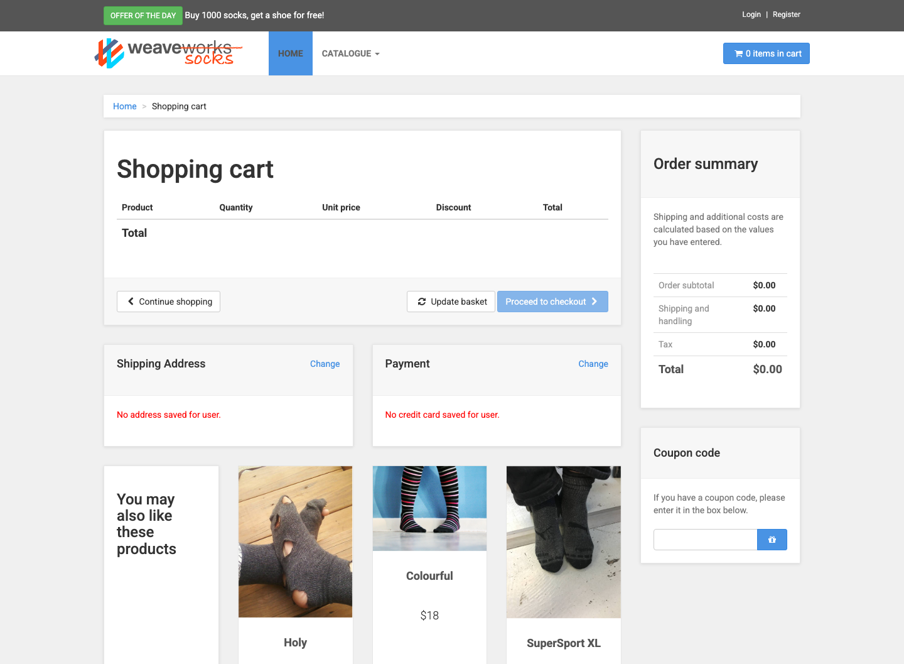
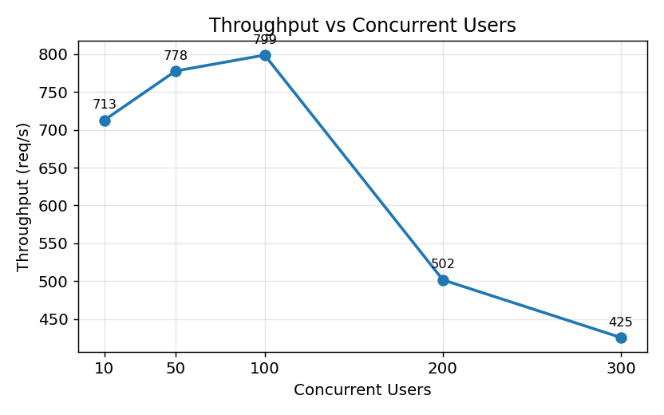
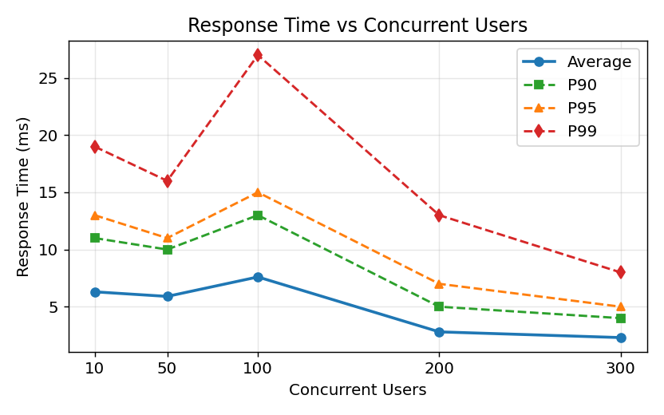
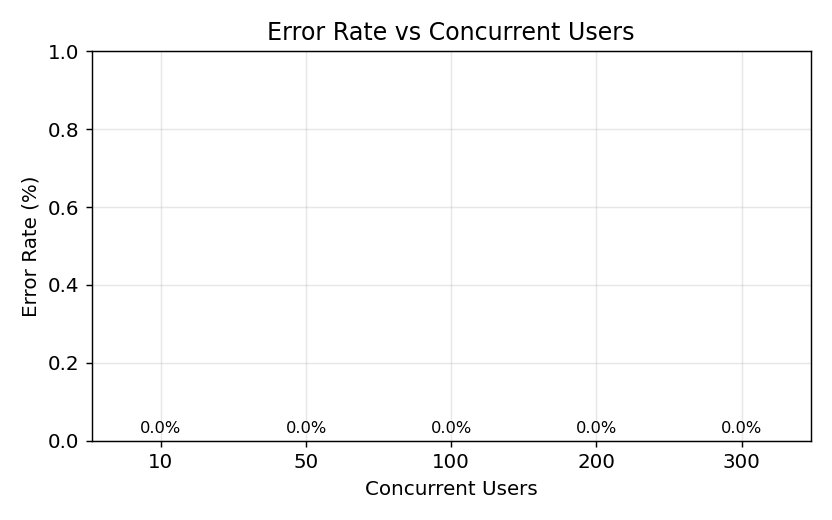

# SockShop 微服务系统测试实验报告

课程：软件测试与维护（2026 年春）
大作业阶段三：使用 Selenium 和 JMeter 进行测试
测试对象：SockShop（Weaveworks 开源微服务电商系统）

---

## 一、实验目的

这次实验是大作业的第三阶段，主要任务是在已经部署好的 SockShop 系统上，用 Selenium 和 JMeter 这两个工具做测试。简单说就是两件事：

- 用 Selenium 写脚本，模拟用户在网页上的操作（浏览商品、注册登录、下单这些），看看前端功能能不能正常用，顺便记一下页面加载和操作要多久。
- 用 JMeter 模拟很多人同时访问，给后端服务发大量请求，看看系统在高并发下扛不扛得住，记录响应时间、吞吐量、错误率这些指标。

---

## 二、实验环境

| 项目 | 说明 |
|------|------|
| 操作系统 | macOS（Apple 芯片，arm64） |
| 容器 | Docker Desktop |
| 编排工具 | Docker Compose |
| 功能测试 | Selenium 4.44（Python） |
| 浏览器 | Chrome 149 / Safari |
| 性能测试 | JMeter 5.6.3（需要 Java） |
| 访问地址 | http://localhost:8079 |

因为用的是 Apple 芯片的 Mac，SockShop 的官方镜像是 amd64 的，所以是靠 Docker 模拟运行的，速度上可能稍微慢一点，不过容器都能正常跑起来。

---

## 三、SockShop 系统简介

SockShop 是一个卖袜子的电商示例项目，由很多个小服务组成，是学习微服务比较常用的一个 demo。这次部署了一共 14 个容器，主要的服务有下面这些：

| 服务 | 作用 |
|------|------|
| front-end | 前端页面 |
| catalogue | 商品目录（带一个 MySQL 数据库） |
| user | 用户账号（带 MongoDB） |
| carts | 购物车（带 MongoDB） |
| orders | 订单（带 MongoDB） |
| payment | 支付 |
| shipping / queue-master / rabbitmq | 物流和消息队列 |

部署好之后这个网站功能挺全的，能浏览商品（一共 9 件袜子）、注册登录、加购物车、下单。



图 3-1　商品目录页面（Selenium 跑测试时自动截的图）

---

## 四、测试思路

整体分成两部分：功能测试用 Selenium 模拟一个用户正常逛网站，主要看功能对不对；性能测试用 JMeter 模拟一堆人同时访问，主要看性能和稳不稳定。

功能测试这边按照一个用户从打开首页到最后下单的顺序，设计了 8 个测试用例。性能测试这边设置了 10、50、100、200、300 这几个不同的并发用户数，分别压一下，看看请求多了之后性能会怎么变。

---

## 五、Selenium 功能测试

### 5.1 测试用例

按照用户买东西的流程，设计了 8 个用例：

| 编号 | 测试内容 | 看什么 |
|------|----------|--------|
| TC01 | 打开首页 | 标题对不对、商品图片有没有出来 |
| TC02 | 浏览商品列表 | 商品能不能正常显示 |
| TC03 | 看商品详情 | 商品名字、价格对不对 |
| TC04 | 注册 | 能不能注册成功 |
| TC05 | 登录 | 能不能登录 |
| TC06 | 加购物车 | 点了之后购物车数量变没变 |
| TC07 | 看购物车 | 加的东西在不在里面 |
| TC08 | 下单 | 能不能走下单流程 |

### 5.2 实现说明

脚本用 Selenium 的 WebDriver 控制浏览器，主要用元素的 id 或者 CSS 选择器来找页面上的按钮、输入框。因为这个网站的商品列表是异步加载出来的（JS 渲染），所以加了 WebDriverWait 等一下，等元素出来了再操作，不然容易找不到。每个用例跑完会自动截一张图存起来，结果也会存成 JSON 文件方便后面看。

页面加载时间是通过浏览器自带的 performance.timing 拿到的，比直接掐秒表准一点。

### 5.3 测试结果（Chrome）

| 用例 | 结果 | 加载(ms) | 操作(ms) | 备注 |
|------|------|---------|---------|------|
| TC01 首页 | 通过 | 804 | — | 标题 WeaveSocks，商品图 15 张 |
| TC02 浏览目录 | 通过 | 25 | — | 商品图 12 张 |
| TC03 商品详情 | 通过 | 23 | — | 商品 Holy，价格 $99.99 |
| TC04 注册 | 通过 | 28 | 3020 | 注册成功跳转 |
| TC05 登录 | 通过 | 33 | 3019 | 登录成功 |
| TC06 加购物车 | 通过 | — | 2010 | 购物车显示 1 件 |
| TC07 看购物车 | 通过 | — / 21 | — | 购物车里有东西 |
| TC08 下单 | 通过 | — | 3009 | 下单流程走通了 |

8 个用例全部通过，平均加载时间 156ms 左右，首页最慢（800ms 多），应该是因为首页图片比较多。



图 5-1　各用例的加载和操作时间（Chrome）

这里要说明一下：表里「操作时间」那一列有的是 2000-3000ms，其实不是服务器真的反应那么慢，是我们脚本里点完按钮之后特意加了 sleep 等几秒，怕页面还没刷新好就去判断结果会出错。真正的服务器响应速度看后面 JMeter 那部分更准。

### 5.4 换个浏览器试试（兼容性）

同样的脚本在 Chrome 和 Safari 上都跑了一遍：

| 浏览器 | 通过情况 | 平均加载(ms) |
|--------|---------|-------------|
| Chrome | 8 / 8 | 156 |
| Safari | 8 / 8 | 181 |

两个浏览器都全过了，加载时间也差不多，说明这个网站在不同浏览器上兼容性还行。

### 5.5 部分截图

| | |
|---|---|
|  |  |
| 图 5-2 首页 | 图 5-3 商品详情 |
|  |  |
| 图 5-4 注册页 | 图 5-5 购物车 |

---

## 六、JMeter 性能测试

### 6.1 测试计划

为了看不同访问量下系统表现怎么样，设置了 5 个不同的并发用户数分别压测。每组的总请求数差不多（2000 到 4200 之间），这样好对比：

| 组 | 并发用户数 | 每人循环次数 | Ramp-up(秒) | 总请求 |
|----|-----------|-------------|-------------|--------|
| 1 | 10 | 100 | 2 | 2000 |
| 2 | 50 | 40 | 5 | 4000 |
| 3 | 100 | 20 | 5 | 4000 |
| 4 | 200 | 10 | 8 | 4000 |
| 5 | 300 | 7 | 10 | 4200 |

每次请求会访问首页和商品目录接口，并且给商品目录的返回加了一个判断（看返回码是不是 200）确认请求成功。

### 6.2 怎么跑的

用的是 JMeter 的命令行模式（加 `-n` 参数），网上说性能测试最好别用图形界面跑，图形界面比较吃内存、影响结果，所以图形界面只用来调脚本：

```bash
jmeter -n -t load_gradient.jmx -l result.jtl -Jthreads=并发数 -Jloops=循环数 -Jramp=爬坡秒
```

### 6.3 测试结果

| 并发数 | 总请求 | 错误率 | 平均(ms) | P90 | P95 | P99 | 最大(ms) | 吞吐量(req/s) |
|--------|--------|--------|---------|-----|-----|-----|---------|--------------|
| 10  | 2000 | 0% | 6.3 | 11 | 13 | 19 | 56 | 712.8 |
| 50  | 4000 | 0% | 5.9 | 10 | 11 | 16 | 49 | 777.8 |
| 100 | 4000 | 0% | 7.6 | 13 | 15 | 27 | 56 | 798.9 |
| 200 | 4000 | 0% | 2.8 | 5  | 7  | 13 | 44 | 501.6 |
| 300 | 4200 | 0% | 2.3 | 4  | 5  | 8  | 39 | 425.3 |

所有组的错误率都是 0%，就算 300 个并发也没有失败的请求，这点还挺意外的。

### 6.4 图表



图 6-1　吞吐量随并发数变化



图 6-2　响应时间随并发数变化



图 6-3　错误率（全程 0）

---

## 七、结果分析

**功能方面：** 8 个功能在 Chrome 和 Safari 上都过了，从浏览到下单整个流程都能正常走。加载速度也还可以，首页因为图多稍微慢点，正常。

**性能方面：**

1. 吞吐量在 10 到 100 并发的时候是往上涨的，到 100 并发时最高，大概 799 req/s。
2. 但是到了 200、300 并发，吞吐量反而掉下来了（500、425 左右）。这一点我们一开始觉得有点奇怪，按理说人多了吞吐应该更高才对。后来分析了一下，可能是因为这两组每个用户循环的次数少（只有 10 次和 7 次），ramp-up 时间又设得比较长，整个测试持续的时间太短，导致算出来的吞吐量偏低，并不一定是系统扛不住了——因为这两组的错误率还是 0，而且最大响应时间反而更小。这块的测试设计可能不太严谨，如果要更准确可能得让每组跑的时间长一点再对比。
3. 响应时间都很快，基本都在 10ms 以内，应该是因为商品数据本来就不多（就 9 件袜子），数据库压力小。
4. 一万六千多个请求全部成功，没有失败的，说明这个负载下系统挺稳的。

总的来说，在我们这个部署规模（基础版 SockShop）下，系统功能正常、响应也快、挺稳定的。不过说实话我们压的请求量可能还不够大，没真正把系统压垮，所以没看到性能瓶颈在哪。如果以后想测出极限，可能得加大并发或者加一些下单这种比较重的写操作。

---

## 八、结论

这次实验把 SockShop 部署起来，用 Selenium 和 JMeter 分别做了功能测试和性能测试。功能测试 8 个用例在两个浏览器上都通过了，性能测试在不同并发下错误率都是 0、响应也很快。基本完成了阶段三要求的内容，对这两个测试工具的用法也熟悉了不少。

要说不足的话，性能测试那块的并发设计还可以再优化，吞吐量的对比不是特别严谨；另外没测一些更复杂的场景（比如多人同时下单）。这些是后面可以改进的地方。

---

## 九、附录：代码和怎么跑

### 目录结构

```
sockshop-testing/
├── docker-compose.yml        # SockShop 部署文件
├── selenium/
│   └── test_sockshop.py      # Selenium 测试脚本
├── jmeter/
│   ├── sockshop_test_plan.jmx
│   ├── load_gradient.jmx     # 梯度压测计划
│   ├── run_gradient.sh       # 批量跑脚本
│   ├── parse_results.py      # 处理结果
│   └── make_charts.py        # 画图
├── screenshots/              # 截图
└── results/                  # 结果和图表
```

### 运行步骤

```bash
# 1. 启动 SockShop
cd sockshop-testing && docker compose up -d
# 浏览器打开 http://localhost:8079 看看通不通

# 2. 跑功能测试
python selenium/test_sockshop.py                  # Chrome
python selenium/test_sockshop.py --browser safari --no-headless  # Safari

# 3. 跑性能测试
zsh jmeter/run_gradient.sh
python jmeter/parse_results.py
python jmeter/make_charts.py
```

代码已经传到 GitHub：https://github.com/Gwen522/SockShop-Homework
